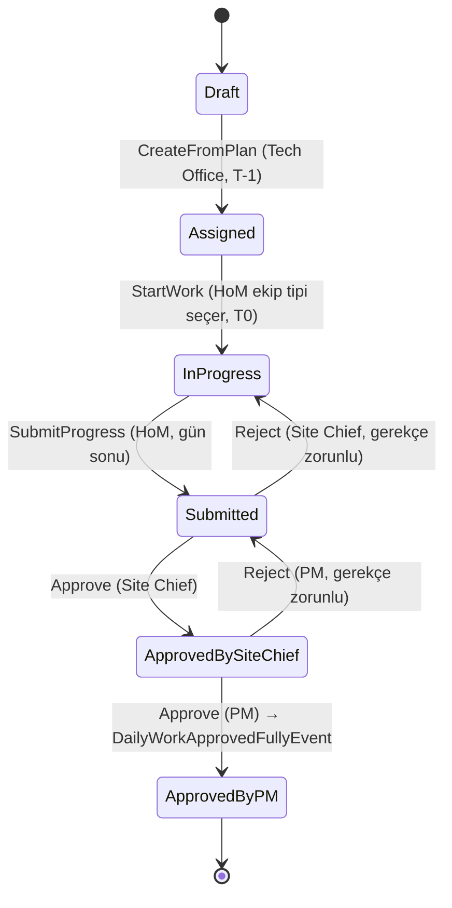
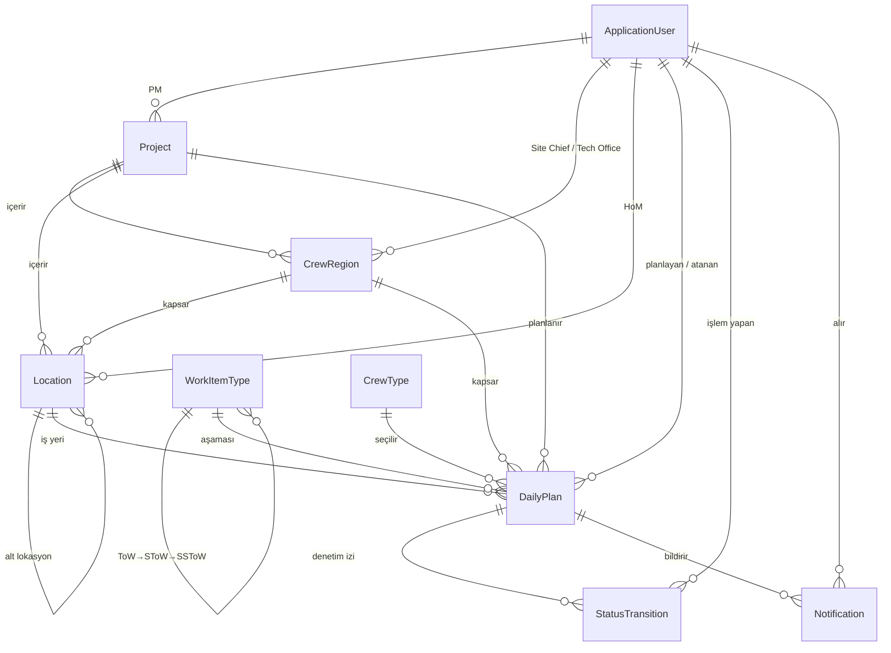

## Repo'yu Ayağa Kaldırma

İki bağımsız, birbiriyle çakışmayan çalışma biçimi var — hangisini kullanacağınız tek ihtiyacınıza göre değişir. İkisi de ilk açılışta migration'ları uygular ve inşaat senaryosuna uygun mock veriyi (proje, bölgeler, ekipler, kullanıcılar, günlük planlar) otomatik seed eder.

### Sadece uygulamayı görmek istiyorsanız (yalnızca Docker gerekir)

.NET SDK veya Node kurulu olmasına gerek yok — tüm build Docker içinde yapılır:

```bash
docker compose up --build
```

| Servis | Adres |
| --- | --- |
| İstemci | http://localhost:5277 |
| API + Scalar dokümantasyon | http://localhost:5292/scalar |
| PostgreSQL (opsiyonel host erişimi, GUI araçları için) | localhost:5433 |

### Aktif geliştirme için (.NET 10 SDK ve Docker gereklidir)

```bash
dotnet run --project src/Workplan.AppHost/Workplan.AppHost.csproj --launch-profile http
```

Aspire AppHost kendi PostgreSQL container'ını + WebApi + Blazor istemciyi tek komutla başlatır; servislerin log/trace/metric ve health durumları dashboard'dan izlenir. IDE'de tek başlangıç projesi olarak `Workplan.AppHost` seçilebilir.

| Servis | Adres |
| --- | --- |
| Aspire Dashboard | http://localhost:15880 |
| İstemci (Blazor WASM) | http://localhost:5276 |
| API + Scalar dokümantasyon | http://localhost:5291/scalar |
| PostgreSQL | localhost:5434 (AppHost'a özel container + volume) |

Bu iki yol tamamen bağımsızdır (ayrı port, ayrı Docker volume) — çakışma olmadan aynı anda bile çalışabilirler.

VS Code'da tek tek proje debug etmek isterseniz (`Workplan API (http)` / `Workplan Client (http)` launch config'leri), `docker: db up` task'ı Aspire ile aynı port (5434) ve volume'u paylaşan ayrı, hafif bir PostgreSQL container'ı (`workplan-dev-db`) başlatır.

**Mock girişleri:**

- `admin@workplan.local` / `ChangeMe123!` - SystemAdmin
- `pm1@workplan.local` / `Demo123!` - Project Manager
- `hom1@workplan.local` / `Demo123!` - Head of Master
- diğer mock çalışan kullanıcıları (`sc1@...`, `to1@...`, `hom2@...` vb.)

Demo veri iki red/iade örneğini hazır getirir:

- `hom5@workplan.local`: Site Chief tarafından iade edilmiş işi **My Work** ekranında görür.
- `sc2@workplan.local`: Project Manager tarafından iade edilmiş işi **Approvals** ekranında görür.

Seeder proje koduna göre idempotenttir ve mevcut demo projeyi güncellemez. Seed tanımı değiştikten sonra temiz veriyle başlamak isterseniz aşağıdaki komutlar ilgili geliştirme verisini **kalıcı olarak siler**:

```bash
# Docker Compose verisi
docker compose down -v
docker compose up --build

# Aspire/VS Code geliştirme verisi (önce AppHost ve workplan-dev-db durmuş olmalı)
docker volume rm workplan-dev-db-data
dotnet run --project src/Workplan.AppHost/Workplan.AppHost.csproj --launch-profile http
```

---

## 1. Beklentiler

| Beklenen Çalışma | Durum | Açıklama |
| --- | --- | --- |
| Katmanlı Mimari Seçimi  | ✅ | Klasik N-Layer’ın karmaşıklığı ve bağımlılık durumları göze alınarak; Clean Architecture ve mümkün olduğunca DDD standartlarına uygun geliştirme yapıldı.. |
| UI Yaklaşımı (Desktop/Mobile) | ✅ | Tek responsive Blazor WASM uygulaması. masaüstü planlama + mobil-uyumlu saha ekranları  |
| Offline Senaryosu | Kısmi | PWA manifest + Service Worker uygulama kabuğunu cache’ler; offline API verisi, komut kuyruğu, idempotency ve senkronizasyon henüz yoktur. |
| Güvenlik Yaklaşımı | ✅ | JWT + Refresh token, rol bazlı endpoint koruması, domain seviyesinde kapsam (scope) doğrulaması |

---

## 2. Roller ve Yetki Modeli

| Rol | Sorumluluk | Yetki  |
| --- | --- | --- |
| **Technical Office Engineer** (submitted by) | T-1 Daily Plan oluşturur, iş kalemi + miktar/adam-gün girer, Head of Master’a atar | Her **bölgenin** (CrewRegion) bir Tech Office’i vardır → `CrewRegion.TechOfficeUserId` |
| **Head of Master** | Atanan işleri görür, ekip tipi seçerek işi başlatır, gün sonu gerçekleşmeyi girer | Her **lokasyona (KKK)** bir HoM atanır → `Location.HeadOfMasterUserId` |
| **Site Chief** | Gün sonu kayıtlarını onaylar (1. kademe) | Her **bölgenin** bir Site Chief’i vardır → `CrewRegion.SiteChiefUserId` |
| **Project Manager** | Son onayı verir, iş kapanır (2. kademe) | Tüm **projenin** bir PM’i vardır → `Project.PmUserId` |
| **SystemAdmin** | Kullanıcı/rol yönetimi, master data (proje, bölge, lokasyon, iş kalemi, ekip tipi) yönetimi |  |

## 3.  Varsayımlar

- **KKK = Location.** Senaryodaki “Lokasyon (KKK)” birebir `Location` entity’sine; “bölge (crew region)” `CrewRegion`’a; “ToW/SToW/SSToW” 3 seviyeli `WorkItemType` ağacına eşlendi.
- **Onay zinciri sadeleştirildi:** HoM submitter olduğu için etkin onay Site Chief → PM (bkz. §3).
- **Bir DailyPlan = bir yaprak iş kalemi + işe başlarken seçilen ekip tipi** (MVP tekilliği; `CrewTypeId` tek referans).
- **Senaryo verisi:** Mersin Nükleer Güç Santrali - Ünite 1 İnşaat Projesi üzerine anlamlı Türkçe demo veri seed edilir (idempotent).
- Zaman damgaları **UTC**; iş tarihi `DateOnly` (`WorkDate`).

---

## 4. İş Akışı



**Adım adım:**

1. **T-1 (Draft → Assigned):** Tech Office, aylık üretim planından yola çıkarak Daily Plan oluşturur. Proje + ToW→SToW→SSToW yaprak iş kalemi + Lokasyon seçer, `PlannedQuantity`, `PlannedManDay` ve `Unit` girer, ilgili Head of Master’a atar.
2. **T0 (Assigned → InProgress):** Head of Master kendisine atanan işi görür (Home ekranı + bildirim), iş detayında tek ekip tipi seçer ve işi başlatır (`StartWork`). Sistem seçimi doğrudan `DailyPlan.CrewTypeId` olarak kaydeder; MVP'de ekip/personel satırı tutulmaz.
3. **Gün Sonu (InProgress → Submitted):** Gerçekleşen `FactQuantity`, `FactManDay`, `Overtime` girilir. **İş kuralı:** miktar ve adam-gün ya birlikte girilir ya da hiç ilerleme yoksa **gerekçe (comment) zorunludur**. Kayıt onaya gönderilir.
4. **Onay (Submitted → ApprovedBySiteChief → ApprovedByPM):** İki kademeli onay. `ApprovedByPM` terminal durumdur. PM onayında `DailyWorkApprovedFullyEvent` domain event’i tetiklenir.
5. **Reddetme:** Red, işi onay zincirinde **bir önceki sorumluya** gerekçeyle geri düşürür. Site Chief reddederse iş HoM ekranına `InProgress` olarak döner; PM reddederse iş Site Chief kuyruğuna `Submitted` olarak döner. Red gerekçesi `StatusTransition.Note` üzerinde audit kaydı olarak saklanır ve ilgili kişiye bildirim üretilir.

Her geçiş `StatusTransition` olarak kaydedilir → audit sağlam.

---

## 5. Çözüm Mimarisi

**Clean Architecture + DDD** Bağımlılıklar yalnızca içe doğru akar, Domain izole ve saf tutulur. Bu şekilde genişletilebilir, ölçeklenebilir bir yapı kuruldu. Feature’lara dilimlendi. İstendiğinde tam modüler

| Katman | Sorumluluk | Öne çıkan yaklaşımlar |
| --- | --- | --- |
| **Domain** | İş kuralları, aggregate’ler, value object’ler, domain event’ler | Encapsulated state machine, private setter, factory metotlar, `Result<T>` (exception yerine) |
| **Application** | CQRS akışları (Command/Query + Handler) | `Mediator` (source-generator), `FluentValidation` pipeline behavior, feature-folder organizasyonu |
| **Infrastructure** | Kalıcılık, kimlik, token, seed, integration event teslimatı | EF Core 10 + Npgsql, ASP.NET Identity, JWT, transactional outbox, exponential retry/poison-message, opsiyonel HMAC webhook |
| **WebApi** | HTTP arayüzü ve operasyonel sınırlar | Minimal API grupları, global exception handler, `ApiResponse`, kullanıcı/IP bazlı rate limiting, Serilog, OpenTelemetry, liveness/readiness |
| **Client** | Kullanıcı arayüzü | Blazor WASM, JWT auth state provider, PWA manifest + shell cache; API DTO’larından ayrı client modelleri |
| **SharedKernel** | Katmanlar arası ortak sözleşmeler | `Result`, `Error`, `ApiResponse`, `Roles` |

---

## 6. Veri Modeli (ER)



| Entity | Kritik Alanlar | Rol / Not |
| --- | --- | --- |
| **Project** | `Code`, `Name`, `PmUserId`, `IsActive` | Proje = 1 PM |
| **CrewRegion** | `ProjectId`, `Code`, `SiteChiefUserId`, `TechOfficeUserId` | Bölge = 1 Site Chief + 1 Tech Office |
| **Location (KKK)** | `CrewRegionId`, `Name`, `ParentId`, `HeadOfMasterUserId` | Lokasyon = 1 HoM; `ParentId` ile iç içe (Blok→Kat) ağaç |
| **WorkItemType** | `Name`, `ParentId`, `Level (0/1/2)`, `Unit` | ToW→SToW→SSToW 3 seviyeli ağaç; `Unit` yalnızca yaprakta anlamlı |
| **CrewType** | `Name`, `IsActive` | Proje/bölge/lokasyon bağımsız ekip tipi master datası |
| **DailyPlan** *(aggregate root)* | Planlı: `PlannedQuantity/ManDay/Unit` · Gerçekleşen: `FactQuantity/ManDay/Overtime/Comment` · `Status` | İş akışının kalbi |
| **StatusTransition** | `From`, `To`, `ActionById`, `Note`, timestamp | Değişmez denetim kaydı |
| **Notification** | `UserId`, `Type`, `Link`, `DailyPlanId`, `ReadAtUtc` | İş atama ve red/iade bildirimi |
| **ApplicationUser / RefreshToken** | Identity + rotasyonlu refresh token | Kimlik altyapısı |

## Veri Modeli Özet

Bu veri modelinin tam kalbinde **DailyPlan**, yani günlük iş planı var. Sahadaki her şey (planlama, işin yapılması, rakamların girilmesi, onaylar vs.) bu kayıt üzerinden dönüyor.

Sistemdeki hiyerarşi ve roller ise şöle:

- **Project (Proje):** En tepedeki yapı. Her projenin başında bir **Project Manager (PM)** var ve nihai sorumluluk onda. Projeler alt bölgelere ve lokasyonlara ayrılıyor.
- **CrewRegion (Bölge):** Sahadaki operasyonel bölgeler. Burada **Tech Office** işi planlarken, **Site Chief** de bölgenin kontrol ve onayından sorumlu. Yani planlamacı ile onaycı net şekilde ayrılmış.
- **Location (Lokasyon):** İşin yapılacağı tam yer (Blok -> Kat -> Alan gibi hiyerarşik olabiliyor). Her lokasyonun başında bir **Head of Master** var, sahayı o çekip çeviriyor.
- **CrewType (Ekip Tipi):** Head of Master işi başlatırken proje/bölge/lokasyon bağımsız master listeden tek ekip tipi seçer. MVP'de crew, crew member, kişi veya sicil tutulmaz.
- **WorkItemType (İş Kalemleri):** İş türlerini (Ana iş, alt iş, detay iş) gösteren 3 aşamalı bir ağaç yapısı. Günlük planlar hep en detaydaki iş kalemi (Ton, m³ vs.) üzerinden yapılıyor.

### Proje, Saha Bölgesi ve Lokasyon Nasıl Düşünülür?

- **Proje root kayıttır.** İşin en üst bağlamıdır; örneğin demo veride `Mersin Nükleer Güç Santrali - Ünite 1 İnşaat Projesi`. Projenin sorumlusu **Project Manager**dır (`Project.PmUserId`). Raporlama, PM kapsamı ve üst seviye filtreleme proje üzerinden başlar.
- **Saha bölgesi proje bazlıdır ve çokludur.** Bir projenin birden fazla operasyon bölgesi olabilir; demo veride `NI - Nükleer Ada`, `CI - Konvansiyonel Ada ve Türbin Tesisi`, `BOP - Yardımcı Tesisler ve Boru Koridorları`, `MW - Deniz Yapıları ve Soğutma Suyu Sistemleri` gibi. Her bölgenin bir **Site Chief**i ve bir **Technical Office** sorumlusu vardır (`CrewRegion.SiteChiefUserId`, `CrewRegion.TechOfficeUserId`).
- **Lokasyon saha bölgesinin altındaki gerçek iş yeridir.** Lokasyonlar proje ve bölgeye bağlıdır; ayrıca `ParentId` ile ağaç gibi iç içe olabilir. Örneğin `CI - Konvansiyonel Ada ve Türbin Tesisi` altında önce `Konvansiyonel Ada Ana Yerleşkesi`, onun altında `1UMA - Türbin Binası` bulunur. Her iş yapılabilir lokasyonda bir **Head of Master** atanabilir (`Location.HeadOfMasterUserId`).
- **DailyPlan bu üçlüyü birlikte taşır.** Günlük plan oluşturulurken proje + saha bölgesi + lokasyon seçilir ve kayıt üzerinde `ProjectId`, `CrewRegionId`, `LocationId` olarak saklanır. Böylece işin hangi projeye ait olduğu, hangi bölgenin onay akışına gireceği ve sahada hangi HoM’un ekranına düşeceği aynı kayıt üzerinden netleşir.

Basit örnek:

```text
Project
└─ Mersin Nükleer Güç Santrali - Ünite 1 İnşaat Projesi (PM)
   └─ CI - Konvansiyonel Ada ve Türbin Tesisi (Site Chief + Tech Office)
      └─ Konvansiyonel Ada Ana Yerleşkesi
         └─ 1UMA - Türbin Binası (Head of Master)
```

### İş Nasıl Akıyor?

**DailyPlan** dediğimiz şey aslında tüm sürecin yönetim merkezi. Planlanan/gerçekleşen miktarlar, adam-gün sayıları, mesailer ve işin durumu (Onay bekliyor, reddedildi, tamamlandı vs.) hep burada.

İşin takibi ve güvenliği için de şu yapılar var:

- **StatusTransition:** Kim, ne zaman, hangi durumu değiştirdi, ne not bıraktı... Hepsini logluyor. Yani geriye dönük tam bir denetim izi var.
- **Notification:** Rolere göre bildirim atıyor. Yeni iş atandığında HoM bilgilendirilir; red durumunda işin düştüğü önceki sorumluya (`DailyPlanRejected`) bildirim gider.
- **ApplicationUser & RefreshToken:** Sistem girişleri ve yetkileri yönetiyor. Roller (PM, Site Chief vb.) zaten yukarıda saydığım iş akışına göre dağıtılmış durumda.

---

## 7. REST API Tasarımı

Kaynak-odaklı, `/api/{kaynak}` gruplu, tutarlı `ApiResponse<T>` zarfı ve rol bazlı yetkilendirme kullanılır. Aşağıdaki tablo özettir; tam ve güncel sözleşmenin kaynağı geliştirme ortamındaki OpenAPI/Scalar’dır (`/scalar`).

Tüm `/api` çağrıları authenticated kullanıcı ID’si, anonim çağrılar ise istemci IP’si bazında token-bucket rate limit’e tabidir. Limit aşımında `429` ve `rate_limited` kodlu standart API hata zarfı döner. `/health`, Scalar ve OpenAPI bu limitin dışındadır.

| Grup | Endpoint (özet) | Yetki |
| --- | --- | --- |
| **Auth** | `POST /login`, `/refresh`, `/revoke`, `/register`, `GET /me` | register: SystemAdmin |
| **Projects** | `POST /`, `GET /`, `GET /{id}`, `PUT /{id}`, `POST /{id}/activation` | yazma: Admin/TechOffice |
| **CrewRegions** | `POST /`, `GET /by-project/{id}`, `assign-site-chief`, `assign-tech-office` | yazma: Admin/TechOffice |
| **Locations** | `POST /`, `GET /by-region/{id}`, `assign-head-of-master`, `activation` | yazma: Admin/TechOffice |
| **WorkItemTypes** | `POST /`, `GET /tree`, `PUT /{id}`, `activation` | ağaç herkese okunur |
| **CrewTypes** | `GET /` · `POST /` · `PUT /{id}` · `POST /{id}/activation` | okuma: authenticated · yazma: Admin/TechOffice |
| **DailyPlans** | create/start/submit/approve/reject · `GET /my-work` · `/approval-queue` · `/{id}/detail` · `/tracking` · `/tracking/options` · `/awaiting-approval` · `/approved` | aksiyonlar role; okumalar role + scope’a göre daraltılır |
| **Reports** | `GET /api/reports/daily` | Admin/TechOffice/SiteChief/PM + scope |
| **Notifications** | `GET /unread`, `POST /{id}/read`, `POST /daily-plan/{id}/read` | authenticated |
| **Users** | `GET /?role=`, `POST /`, `PUT /{id}/roles`, `activation`, `reset-password` | yönetim: SystemAdmin |
| **Health** | `GET /health/live`, `GET /health/ready` | API dışı operasyon endpointleri |

---

## 8. Ekranlar (UI)

Tek bir **responsive** Blazor WASM uygulaması; masaüstü ağırlıklı planlama ekranları ile mobil-uyumlu saha ekranlarını aynı kod tabanında karşılar.

| Ekran | Kullanıcı | Amaç |  |
| --- | --- | --- | --- |
| **Login** | Herkes | JWT ile giriş |  |
| **Home** | Herkes | Role göre özet + okunmamış bildirimler | Mobil |
| **DailyPlanCreate** | Tech Office | T-1 plan oluşturma; ToW/SToW/SSToW kolon seçici, miktar/adam-gün, HoM atama | **Desktop** |
| **MyWork** | Head of Master | Atanan işler listesi; HoM'a iade edilen redler kırmızı uyarıyla görünür | **Mobil** |
| **AssignedWorkDetail** | Head of Master | Ekip tipi seçerek işi başlat, gün sonu gerçekleşme gir (`ProgressForm`) | **Mobil** |
| **Approvals** | Site Chief / PM | Onay bekleyenler + onayla/reddet; PM'den Site Chief'e iade edilen redler kırmızı uyarıyla görünür | Mobil/Desktop |
| **DailyTracking** | Admin/TechOffice/SiteChief/PM/HoM | Tarih, sorumlu, lokasyon ve durum filtreleriyle günlük saha takibi | Desktop |
| **Reports** | Admin/TechOffice/SiteChief/PM | Onaylanan işler + yönetici izleme (ustabaşı bazlı) | Desktop |
| **Projects / CrewRegions / Locations / WorkItemTypes / CrewTypes** | Admin/TechOffice | Master data yönetimi | Desktop |
| **Ekip Tipleri (`/crews`)** | Admin/TechOffice | Proje/bölge/lokasyon bağımsız ekip tipi CRUD yönetimi | Desktop |
| **UserManagement** | SystemAdmin | Kullanıcı, rol, aktiflik, parola sıfırlama | Desktop |

---

## 9. Bildirim ve Raporlama

**Bildirim:** İş atandığında (`DailyPlanAssigned`) ilgili HoM için `Notification` üretilir. Red durumunda (`DailyPlanRejected`) bildirim işin geri düştüğü önceki sorumluya gider: Site Chief reddinde HoM, PM reddinde ilgili Site Chief bilgilendirilir. İstemci `GET /notifications/unread` ile okunmamışları çeker ve Home ekranında gösterir. Şu an **REST tabanlı** (sayfa/oturum yenilemede çekilir); gerçek zamanlı push (SignalR/FCM) **bilinçli olarak MVP dışı.**

**Raporlama:** Onaylanan (`ApprovedByPM`) kayıtlar `/api/reports/daily` ve Reports ekranında kapsam filtreleriyle konsolide edilir. Onaylanmış işler, KPI özeti ve ustabaşı bazlı yönetici izlemesi uygulama içinde hazırdır.

**Integration event teslimatı:** PM son onayında oluşan `DailyWorkApprovedFullyEvent`, aynı veritabanı transaction’ında `DailyPlanFullyApproved` outbox mesajına çevrilir. Hosted dispatcher mesajları exponential retry ile işler; retry sınırını aşan kayıtlar poison olarak işaretlenir. `IntegrationWebhook` varsayılan olarak kapalıdır. Etkinleştirildiğinde event ID/type başlıkları ve HMAC-SHA256 imzasıyla **at-least-once** HTTP teslimatı yapar; tüketici event ID üzerinden deduplication uygulamalıdır.

Canlı Power BI bağlantısı, özel PostgreSQL view/read model ve DirectQuery yapılandırması henüz uygulanmamıştır.

**KPI’lar (veri seti hazır):** Plan/Gerçekleşen (`Planned` vs `Fact` Quantity/ManDay), Verimlilik (`FactManDay/PlannedManDay`), Overtime toplamı tümü `DailyPlan` üzerinde mevcut alanlardan türetilebilir.

---

## 10. Offline Senaryosu

Saha istemcisi online-first çalışır. PWA manifest’i ve publish edilen Service Worker, uygulama kabuğunu (WASM/DLL/JS/CSS ve statik varlıklar) cache’leyerek arayüzün açılabilmesini destekler.

Bu destek veri/işlem offline’ı anlamına gelmez: API verisi cache’lenmez; IndexedDB command outbox, offline mutation, `Idempotency-Key`, tekrar gönderim koruması ve conflict resolution uygulanmamıştır. Bunlar tam offline senkronizasyon için gelecek çalışmalardır.

---

## 11. Güvenlik Yaklaşımı

| Katman | Önlem |
| --- | --- |
| **Kimlik** | ASP.NET Core Identity; parola hash + politika |
| **Oturum** | Erişim token'ı sabit ömürlü (varsayılan 60 dk), süresi dolunca yenilenmeden geçersiz kalıyor. Yenileme token'ı ise kayan (sliding) pencere mantığında: her kullanımda eskisi iptal edilip yerine, süresi yine o andan itibaren başlayan yeni bir token veriliyor (rotation). Yani kullanıcı aktif kaldığı sürece oturum süresiz uzayabiliyor; üst sınır olarak yalnızca "X gündür yenilenmedi" durumu oturumu sonlandırıyor. |
| **Yetkilendirme (yatay)** | Endpoint bazında `RequireRole(...)`  her aksiyon yalnızca ilgili role açık |
| **Yetkilendirme (dikey/kapsam)** | Domain seviyesinde **scope kontrolü**: `StartWork`/`SubmitProgress`, işin gerçekten o HoM’a atanmış olmasını `AssignedHoMId == actorId` ile doğrular (`ScopeMismatch`) . yani “doğru rol” yetmez, “senin işin mi” de sorulur |
| **Transport** | HTTPS redirection; CORS yalnızca bilinen istemci origin’lerine |
| **İstek sınırı** | Tüm `/api` çağrılarında kullanıcı/IP bazlı token-bucket rate limit; aşımda standart `429 rate_limited` yanıtı |
| **Hata sızıntısı** | Global exception handler → tek tip `ApiError`, iç detay sızmaz |
| **Denetim** | Her durum geçişi `StatusTransition` ile kim/ne zaman/gerekçe olarak kalıcı |

**Kapsam kontrolü (`AccessScopeService`):** `Application` katmanında `IAccessScopeService` üzerinden merkezi scope filtresi uygulanır. Listeleme/detail query'lerinde `ApplyProjectScope`, `ApplyCrewRegionScope`, `ApplyLocationScope` ve `ApplyDailyPlanScope` ile `IQueryable` daraltılır; command handler'larda ise `CanAccess...Async` metodları ile tekil kayıt erişimi kontrol edilir. `SystemAdmin` tüm kapsama erişir; diğer roller yalnızca kendi ilişkili kayıtlarını görür/işler: PM kendi projesini, Site Chief ve Technical Office kendi bölgelerini, Head of Master ise kendine atanmış lokasyon ve planları.

---

## 12. Teknoloji Seçimleri ve Gerekçeleri

| Alan | Seçim | Gerekçe | Değerlendirilen Alternatif |
| --- | --- | --- | --- |
| **Backend** | .NET 10, Minimal API | Sağlam ekosistem, hızlı geliştirme, kurumsal kanıtlanmış | Minimal API yerine Controller, 
ya da tamamen farklı bir dil ve framework (Java, Go) |
| **CQRS/Mediator** | `Mediator` (source-generator) | Mediatr lisansı yerine iyi alternatif.  | Direkt servis yapısı, ya da Mediatr (son sürümleri açık kaynak değil lisanslı) |
| **Workflow** | Code içi custom | MVP için 3rd party entegrasyona gerek duyulmadı | Elsa Workflow entegrasyonu yazılabilir |
| **Doğrulama** | FluentValidation + pipeline behavior | Test edilebilir, sağlam | DataAnnotations (zengin senaryolarda yetersiz) |
| **Veritabanı** | PostgreSQL 16 | Açık kaynak, güçlü ekosistem, community desteği | SQL Server, EF Core ile bazı durumlarda daha uyumlu. Lisans durumu var. |
| **ORM** | EF Core + Npgsql | .NET tam uyum, çoklu DB desteği  | Dapper. EF Core ile Query kısımlarında beraber kullanılabilir 
Raporlamalar için daha esnek ve performanslı. |
| **Kimlik** | ASP.NET Identity + JWT/Refresh | MVP için en iyisi, hazır yapı, Amerika’yı tekrar keşfettirmeyen paket kodlar; JWT sektör standartı, mobil için potansiyel native app yazımı için ideal. | Keycloack, OIDC uyumu, ayrı yönetim vs olabilir. |
| **Frontend** | Blazor WebAssembly + Tailwind | C# / .NET developer için hızlı geliştirme, responsive UI ve PWA shell cache desteği | React + Vite stack. Kuvvetli bir alternatif ancak MVP hızlı çıkış için tercih edilmedi. |
| **API Dokümantasyonu** | OpenAPI + Scalar | İnteraktif, güncel, geliştirici için uygun | Swagger UI (Scalar daha modern DX) |
| **Deployment** | Docker Compose | **Tek komutla** db+api+client; değerlendirenin ortamından bağımsız tekrarlanabilirlik | Kubernetes (MVP için fazla)
Github Actions ya da Azure Devops ile PROD uygun configler oluşturulabilir. |

---

## 13. Bilinçli Olarak MVP Dışı Bırakılanlar

| Kapsam Dışı | Neden ertelendi | Mimari hazırlık |
| --- | --- | --- |
| **Native mobil uygulama** | Responsive WASM, MVP doğrulaması için yeterli | Aynı REST API’yi native istemci de tüketebilir |
| **Tam offline senkronizasyon** | IndexedDB queue, idempotency ve conflict resolution MVP için ertelendi | PWA manifest + Service Worker shell cache mevcut; veri ve komut senkronizasyonu yok |
| **Gerçek zamanlı push (SignalR/FCM)** | REST unread çekme MVP için yeterli | `Notification` üretimi hazır; taşıma katmanı eklenir |
| **Canlı Power BI entegrasyonu** | Uygulama içi raporlama MVP için yeterli | `DailyWorkApprovedFullyEvent` + transactional outbox hazır; Power BI view/DirectQuery yok |
| **Gerçek İK/personel master verisi** | MVP'de yalnızca `DailyPlan.CrewTypeId` tutulur | İleride Employee tablosu ve kişi ataması ayrı tasarlanabilir |
| **Dosya/foto eki, “ZZZ” zengin detay** | Gün sonu `Comment` alanı MVP ihtiyacını karşılar | Aggregate genişletilebilir |
| **Çoklu proje/organizasyon, gelişmiş overtime onay kuralları** | Tek proje senaryosu yeterli | Model çoklu-projeye hazır (her şey `ProjectId` altında) |
